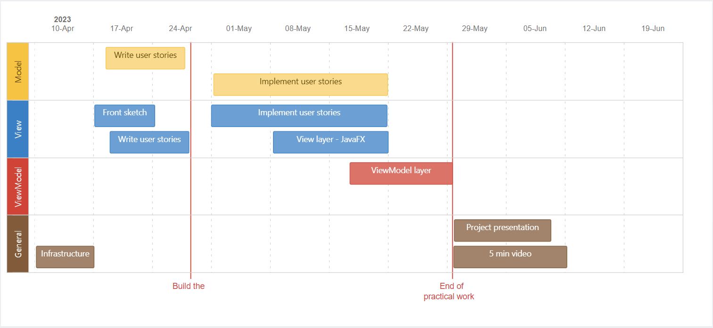

# Book Scrabble Game
Welcome to our final project for the Advanced Software Development course! Our project is a software development project about the Book Scrabble game.

## Description
Book Scrabble is a Java and JavaFX software project that implements a word game where players create words using letter tiles that represent characters from books. The game includes a user-friendly interface that allows up to four players to play simultaneously. It features several algorithms, such as cache management and data structures for efficient word storage and retrieval. Overall, Book Scrabble is a fun and challenging game that tests players' word-building skills.

## Demo Video
* Project presentation + demo video - [click here to video](https://drive.google.com/file/d/1UPFSFeBHdKLqkWO6E3cXAsop8PRzSKna/view?usp=drive_link)

## Features
Our software implementation of Book Scrabble includes the following features:

* A user-friendly interface that allows up to 4 players to easily start and play the game.
* Multi-threaded support for concurrent player actions.
* Algorithms for cache management, including LRU, LFU, and BloomFilter.
* Data structures for efficient word storage and retrieval.
* A dictionary that verifies the words created by players.
* A point system that calculates the score for each player based on the words they create.

## Technologies Used
Our project is built using the following technologies:

* **Java**: A popular programming language for developing robust, portable, and high-performance applications.
* **JavaFX**: A set of graphics and media packages that enables developers to design, create, test, debug, and deploy rich client applications that operate consistently across diverse platforms.
* **LRU, LFU, and BloomFilter algorithms**: Algorithms used for cache management.
* **Data Structures**: Efficient data structures used for word storage and retrieval.

## Communications
* We follow the Scrum framework, holding weekly meetings to discuss progress and address obstacles.
* Jira is used to manage the project's status and milestones, including creating user stories and tracking progress.
* We work in sprints, with each sprint lasting one-two weeks, and prioritize user stories based on input from the team members
* At the end of each sprint, we have a sprint review and retrospective meeting to evaluate our progress and identify areas for improvement.

## Contributors
* [Tal Mekler](https://github.com/TalMekler)
* [Yuval Ofek](https://github.com/YuvalOfek1)
* [Omer Ben-David](https://github.com/OmerBendaa)
* [Ilay Cohen](https://github.com/ilaycohen2712)

## GANTT chart

## Team Work Division

| Task                           | Team Members                                 |
| ------------------------------ | -------------------------------------------- |
| <h4><b>Models</b></h4>  |                                              |
| - Implemented the HostModel logic  | Ilay Cohen                                  |
| - Implemented the GuestModel       | Omer Ben David                              |
| <h4><b>Communications</b></h4> |                                              |
| - Implemented the HostServer logic | Yuval Ofek                                  |
| - Implemented the ClientCommunication logic | Tal Mekler                          |
| <h4><b>Tests</b></h4>  |                                              |
| - Tested the HostModel             | Omer Ben David and Ilay Cohen              |
| - Tested the HostServer            | Tal Mekler                                  |
| - Tested the GuestModel            | Yuval Ofek                                  |
| - Tested the ClientCommunication   | Tal Mekler                                  |
| <h4><b>Documentation</b></h4> |                                              |
| - Whole code documentation (using javadoc) | Everyone                      |
| Art Design and build the game flow (Miro) | Tal Mekler                                |

## Getting Started
To run our Book Scrabble game on your machine, follow these steps:

1. Clone this repository onto your machine.
2. Start the game by running the executable JAR file.

